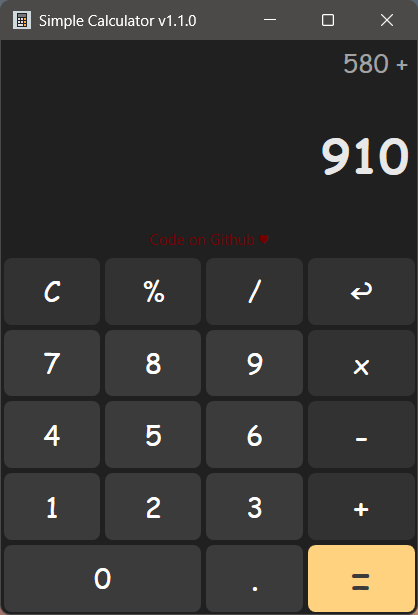
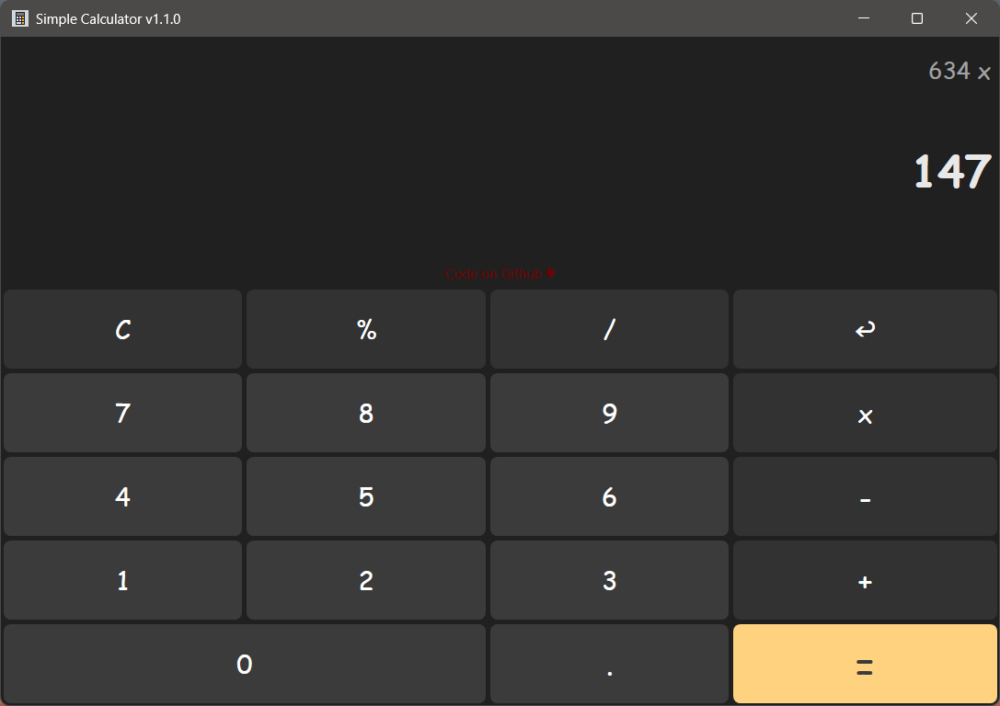

# Simple Calculator 
A Clean GUI Calculator with Minimal Features for Windows

  

## Requirements

- Windows 7 or later
- .NET v6

## 🧐 Features

- Responsive Layout
- Keyboard Support
- Easy to Use
  
## Screenshot

  

  

## Contributing

Contributions are always welcome!
