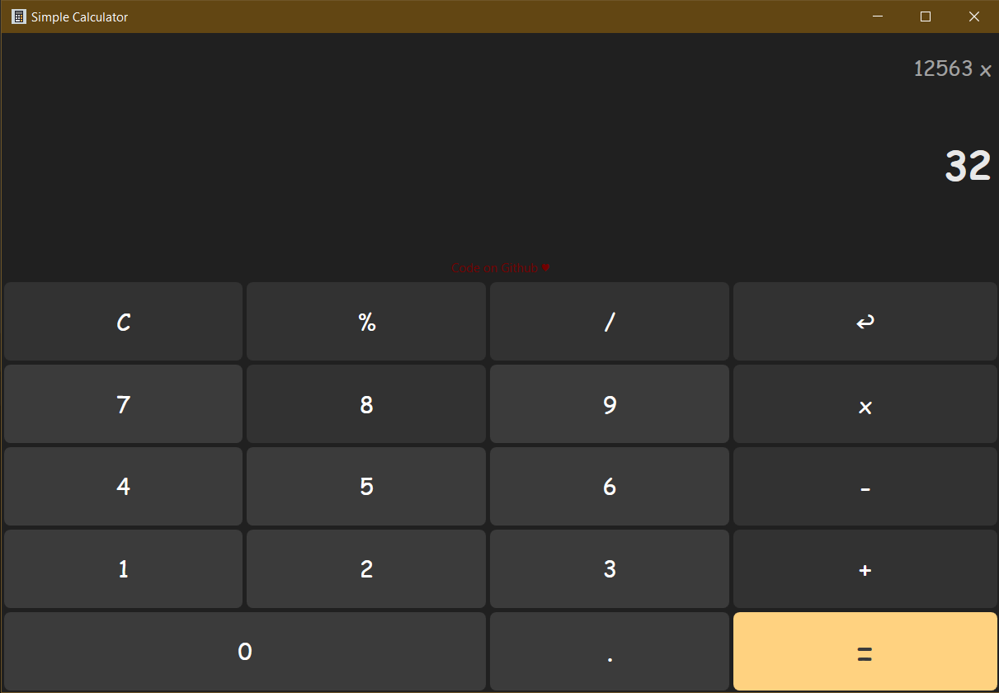

# Simple Calculator 
A Clean GUI Calculator with Minimal Features for Windows

  

## 🛠 Requirements

- Windows 7 or later
- x86 or x64 cpu
- .NET Runtime v6

## 🧐 Features

- Responsive Layout
- Keyboard Support
- Input Validation
  
## Screenshots

  

  

## Contributing 

Contributions are always welcome :hearts: !
